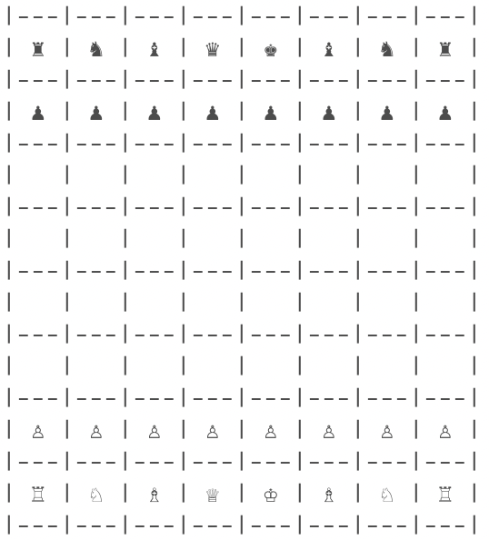

# Bitboards

Each combination of piece type and color (e.g white knights) is represented by an 64-bits integer. We call it a bitboard.
Thus, a chess board includes 12 bitboards (additional bitboards will be added later):
- white pawns
- white knights
- white bishops
- white rooks
- white queens
- white king
- black pawns
- etc

Each square of the chess board is assigned an index in 64 bits, where a1 is index 0 and h8 is index 63, respectively the least significant and most significant bit. The index mapping looks like this:
```
a8 b8 c8 d8 e8 f8 g8 h8      56 57 58 59 60 61 62 63
a7 b7 c7 d7 e7 f7 g7 h7      48 49 50 51 52 53 54 55
a6 b6 c6 d6 e6 f6 g6 h6      40 41 42 43 44 45 46 47
a5 b5 c5 d5 e5 f5 g5 h5  =>  32 33 34 35 36 37 38 39
a4 b4 c4 d4 e4 f4 g4 h4      24 25 26 27 28 29 30 31
a3 b3 c3 d3 e3 f3 g3 h3      16 17 18 19 20 21 22 23
a2 b2 c2 d2 e2 f2 g2 h2      8  9  10 11 12 13 14 15
a1 b1 c1 d1 e1 f1 g1 h1      0  1  2  3  4  5  6  7
```

When the bit value at index 0 is 1, that means square a1 is currently occupied by a piece.

Let's use the starting position as an example: White pawns are placed in a2 to h2, thus the bitboard of white pawns looks like this
```
0 0 0 0 0 0 0 0
0 0 0 0 0 0 0 0
0 0 0 0 0 0 0 0
0 0 0 0 0 0 0 0
0 0 0 0 0 0 0 0
0 0 0 0 0 0 0 0
1 1 1 1 1 1 1 1
0 0 0 0 0 0 0 0
```
This is equal to the number 0x000000000000FF00

Similarly, white knights are placed in b1 and g1, which is the number 0x00000000000042
```
0 0 0 0 0 0 0 0
0 0 0 0 0 0 0 0
0 0 0 0 0 0 0 0
0 0 0 0 0 0 0 0
0 0 0 0 0 0 0 0
0 0 0 0 0 0 0 0
0 0 0 0 0 0 0 0
0 1 0 0 0 0 1 0
```

This is how the board looks in the starting position. It looks boring :smoking:, but it's enough for starter.
<p align="center">
  
</p>

# TODOs

- [ ] move generation

# Learning resource

- https://www.chessprogramming.org/Main_Page
